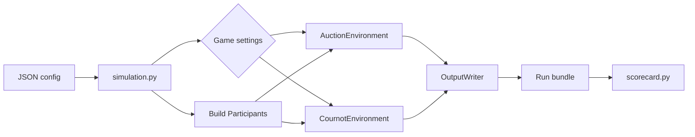

# Architecture

This repository runs repeated games with human, scripted, or
OpenAI-compatible players. Auction and Cournot experiments share the same
small set of data contracts, runner, output writer, and scorecard pipeline.

It also provides additive AI sealed-bid modes. A FastAPI
service schedules persistent batches, and a separately organized Dash frontend
uses only the REST API. Legacy CLI modes remain the default.

## Design Principles

- Keep each game self-contained in one environment module.
- Keep game selection explicit in `simulation.py`.
- Use the `Agent` protocol so any object with `name` and `decide()` can play.
- Give agents observations and legal actions; keep settlement inside the game.
- Write the same output bundle for every game.

## Repository Layout

```text
simulation.py                       Config loading and experiment runner
sandbox/
  models.py                         Shared observations, actions, and players
  environment.py                    Abstract environment interface
  serialization.py                  JSON, JSONL, and CSV output
  scorecard.py                      Cross-run outcome extraction and comparison
  visualization.py                  Cournot player score summary and SVG chart
  playback.py                       Cournot event timeline and interactive HTML
  agents/
    human_cli.py                     Human auction player
    openai_compatible.py             OpenAI-compatible auction player
    cournot_best_reply.py             Scripted Cournot player
    cournot_openai_compatible.py      OpenAI-compatible Cournot player
    llm_auction.py                     Provider-neutral auction policy
  providers/                           OpenAI, Claude, Gemini, and local Llama adapters
  api/                                 Validation, persistent jobs, aggregates, REST API
  games/
    auction/environment.py           Auction rules and settlement
    cournot/environment.py           Cournot rules and settlement
examples/                            Runnable JSON configurations
tests/test_cournot.py                Cournot unit and pipeline tests
frontend/                             Dash UI, API client, figures, and CSS
webapp.py                             FastAPI/Dash composition entrypoint
```

## Execution Flow



The web flow is `Dash -> /api/v1 -> SimulationJobManager ->
AuctionEnvironment -> run bundles/results.json`. The manager runs separate
simulations concurrently within configured limits, while each strict auction
round snapshots all observations and requests up to four sealed bids at once
behind a process-wide provider-call semaphore.

Prompt templates are rendered by `sandbox/prompts.py` from one participant's
`Observation`. The renderer has no reference to the environment's full state.
Canonical provider requests return as decision metadata and flow through the
existing environment logger and serializer.

## Provider contracts

`LLMProvider.generate()` accepts a provider-neutral request containing messages,
model, JSON schema, and generation options, and returns normalized text, usage,
request ID, and finish metadata. `LLMAuctionAgent` implements the existing
`Agent` protocol on top of that provider contract. The legacy
`OpenAICompatibleAgent` and its Cournot subclass are preserved.

Profiles are loaded from `config/providers.json`, with process/`.env` values
taking precedence for models and endpoints. API keys remain server-side.

## Web API

- `GET /api/v1/providers` returns sanitized provider profiles.
- `GET /api/v1/prompts` returns prompt defaults and placeholder documentation.
- `POST /api/v1/prompts/preview` validates and renders a preview.
- `POST /api/v1/simulations` validates and queues a batch.
- `GET /api/v1/simulations/{id}` reports progress and errors.
- `GET /api/v1/simulations/{id}/results` returns authoritative rows and aggregates.

Job and result state is persisted under `runs/web/<simulation-id>/`. A server
restart marks unfinished in-process jobs failed; completed results remain
readable without an external queue.

An optional `experiment_matrix` is expanded into deterministic treatment cells
before the existing job executor runs them. Each cell still creates a normal
`AuctionEnvironment`; matrix code never settles auctions or reads hidden state.
Run-level aggregates are the sampling unit for SD and Student-t intervals.

`run_experiment()` performs five operations:

1. Load the JSON configuration and optional `.env` values.
2. Build each `Participant` and its configured agent policy.
3. Construct `AuctionEnvironment` or `CournotEnvironment`.
4. Run rounds until `environment.is_done()` is true.
5. Add common run metadata and write the output bundle.

Cournot runs automatically pass the completed run directory to
`scorecard.analyze_runs()`. Auction runs do so when `--analyze` is present.
`--analysis-output` selects a custom destination and also enables analysis.

## Shared Contracts

The shared types live in `sandbox/models.py`:

- `Observation` contains public state, private player state, and legal actions.
- `Action` contains an action type, structured value, and short reasoning.
- `LegalActions` describes the action type and its numeric limits.
- `AgentDecision` combines an action with optional latency or retry metadata.
- `Agent` is a protocol requiring `name` and `decide(observation)`.
- `Participant` combines player identity, agent type, role, and agent policy.

`Environment` defines the methods every game supplies: `reset`, `observe`,
`legal_actions`, `step`, and `is_done`. Each concrete environment also owns its
round loop, settlement logic, event logging, and tabular output rows.

## Game Modules

### Auction

`AuctionEnvironment` generates private values, accepts bids, chooses a winner,
settles first- or second-price payments, and records payoff, regret, and
allocative efficiency.

### Cournot

`CournotEnvironment` models four firms choosing quantities for 40 periods. It
implements the paper's linear demand, unit marginal cost, 0.01 quantity grid,
2/3 revision probability, and BEST/FULL information treatments.

BEST exposes market rules and aggregate opponent output. FULL additionally
exposes each firm's previous quantity and profit. The environment always keeps
the complete state internally for settlement and research output.

Cournot currently has two policies:

- `cournot_best_reply`: deterministic local policy for tests and baseline runs.
- `cournot_openai_compatible`: model policy using the existing HTTP adapter and
  a Cournot-specific response schema and prompt.

## Configuration

A configuration contains common experiment fields, one game block, and a list
of participants:

```json
{
  "game_name": "example",
  "output_dir": "runs",
  "cournot": {"rounds": 40, "treatment": "BEST"},
  "participants": [
    {"player_id": "P1", "agent_type": "AI", "policy": "cournot_best_reply"}
  ]
}
```

The actual game block must include every field required by its config
dataclass. Complete examples are in `examples/`.

## Run Bundle

Every run directory contains:

- `events.jsonl`: full decision and settlement audit log.
- `participant_data.csv`: one row per player per round.
- `system_data.csv`: one row per settled round.
- `summary.json`: run metadata and the resolved game configuration.

With `--analyze`, it also contains `analysis/scorecard.json` and
`analysis/scorecard.csv` unless `--analysis-output` points elsewhere.

Cournot analysis runs automatically and also writes the player score CSV and
SVG plus a self-contained `cournot_playback.html` event timeline.

`scorecard.py` reads these files, selects auction or Cournot outcome columns
from `summary.json`, and applies the same cross-run comparison code.

## Adding Another Game

1. Add `sandbox/games/<game>/environment.py` with a config dataclass and an
   `Environment` implementation.
2. Add a game-specific model adapter only when its action schema differs from
   an existing adapter.
3. Add the agent policy and game block branches to `simulation.py`.
4. Return `decisions` and `rounds` tables from the environment.
5. Add outcome columns to `scorecard.py`.
6. Add one runnable configuration and focused pipeline tests.

This explicit approach is intentional. A registry or plugin layer should only
be introduced when the number of games makes the small dispatch branches hard
to maintain.
